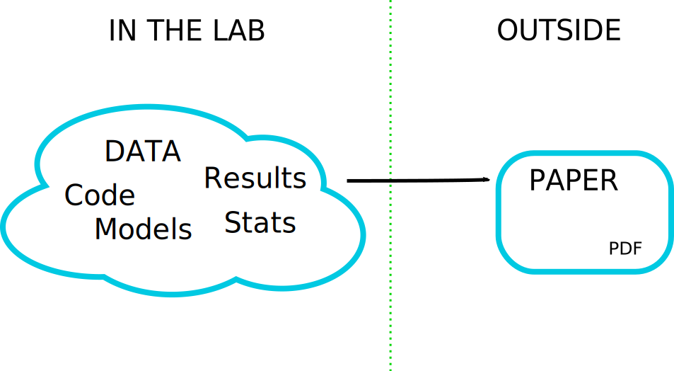
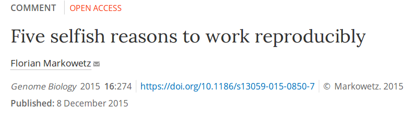

```{r setup, include=FALSE}
options(htmltools.dir.version = FALSE)
```

class: middle
name: cc-by

### Get the slides at [https://bit.ly/2020RSGopen](https://bit.ly/2020RSGopen)

### Read the blog post at [https://bit.ly/open-rr-2](https://bit.ly/open-rr-2)

These slides and blog post are available under a **creative common
[CC-BY license](http://creativecommons.org/licenses/by/4.0/)**. You
are free to share (copy and redistribute the material in any medium or
format) and adapt (remix, transform, and build upon the material) for
any purpose, even commercially .


---
class: middle, inverse

I am **not** speaking from authority here. Authority generally comes
from seniority, and in most cases senior academics aren't those that
have much experience in open and reproducible research.


I don't plan listing technical solutions on how to implement open
and reproducible research.


The real challenges are the (academic) environment we are in, the
inertia of academia and the vested interests of many senior actors.


---
class: middle

## Open / reproducible != good

A piece of open research doesn't automatically make it good, where
good is defined as of high academic quality.


A piece of reproducible research doesn't automatically make it good,
where good is defined as of high academic quality.

---
class: middle

## Reproducible != open

<blockquote class="twitter-tweet" data-cards="hidden" data-lang="en"><p lang="en" dir="ltr">Many people seem to think that <a href="https://twitter.com/hashtag/OpenScience?src=hash&amp;ref_src=twsrc%5Etfw">#OpenScience</a> &amp; the reproducibility crisis in psychology are somehow causally related. They are not. Open science is decades old &amp; did not focus on reproducibility as a single issue — more here: <a href="https://t.co/KpJHIEqPj3">https://t.co/KpJHIEqPj3</a> &amp; here: <a href="https://t.co/KdMeK6PCUT">https://t.co/KdMeK6PCUT</a> <a href="https://t.co/qF5yPTqNqu">pic.twitter.com/qF5yPTqNqu</a></p>&mdash; Olivia Guest | Ολίβια Γκεστ (@o_guest) <a href="https://twitter.com/o_guest/status/1068791012481470464?ref_src=twsrc%5Etfw">December 1, 2018</a></blockquote>
<script async src="https://platform.twitter.com/widgets.js" charset="utf-8"></script>

---
class: middle

The **[Mertonian
norms](https://en.wikipedia.org/wiki/Mertonian_norms)** (1942)

- **Communism**: all scientists should have common ownership of scientific
  goods (intellectual property), to promote collective collaboration;
  secrecy is the opposite of this norm.

- **Universalism**: scientific validity is independent of the
  sociopolitical status/personal attributes of its participants.

- **Disinterestedness**: scientific institutions act for the benefit of a
  common scientific enterprise, rather than for the personal gain of
  individuals within them

- **Organised scepticism**: scientific claims should be exposed to
  critical scrutiny before being accepted: both in methodology and
  institutional codes of conduct.


---
class: middle, inverse, center

## Motivating example


---
class: middle

**Inverse problems** are hard! (Example and figure borrowed from
[Stephen
Eglen](https://sje30.github.io/talks/2017/cam_eglen.html#inverse-problems-are-hard))


| Score (%) | grade |
|:---------:|:-----:|
| 70-100    |    A  |
| 60-69     |    B  |
| 50-59     |    C  |
| 40-49     |    D  |
| 0-39      |    F  |


- **Forward problem**: I scored 68, what was my grade?

- **Inverse problem**: I got a B, what was my score?

---
class: middle


## Research sharing: the inverse problem





---
class: middle

## Where is the scholarship?

> An article about computational science in a scientific publication is not the scholarship itself, it is merely advertising of the scholarship. The actual scholarship is the complete software development environment and that complete set of instructions that generated the figures.

[Buckheit and Donoho 1995, after Claerbout]


---
class: middle, inverse, center

## So what is open research?

---
class: middle

> Open science/research is the process of transparent dissemination
> and access to knowledge, that can be applied to various scientific
> practices.

---
class: middle, center


(image from Wikipedia)

---
class: middle, inverse, center

## Open research isn't stamp collection!

---
class: middle, center

<blockquote class="twitter-tweet"><p lang="en" dir="ltr">21 Tips on
how to sound <a
href="https://twitter.com/hashtag/openscience?src=hash&amp;ref_src=twsrc%5Etfw">#openscience</a>:
in the last three weeks before x-mas, I will tweet on tip each day on
how to sound like an open scientist, without actually doing open
science. Enjoy! <a
href="https://t.co/K7TXb9UmHM">pic.twitter.com/K7TXb9UmHM</a></p>&mdash;
Egon Willighⓐgen (@egonwillighagen) <a
href="https://twitter.com/egonwillighagen/status/1334411812973015040?ref_src=twsrc%5Etfw">December
3, 2020</a></blockquote> <script async
src="https://platform.twitter.com/widgets.js"
charset="utf-8"></script>


---
class: middle, inverse


## Open science/research can mean different things to different people, in particular when declined along its many **technical**, **administrative**, **legal** and **philosophical** attributes.


---
class: middle, inverse, middle

## Don't exclude based on a definition of openness

---
class: middle, inverse


So my very first take-home messages are:


## Open isn't binary, it's a gradient, it's multidisciplinary, it's multidimensional

How to be an open scientist:

## Let's be open and understanding of different situations and constraints, including our own


---
class: middle, inverse, center

Sometimes, beware of what is **sold** as open

## Open research as a business:
## ~~Open Access~~  **Open Acce$$**

---
class: middle

- **Green open access**: post your **pre-print** (on
  [arXiv](https://arxiv.org/), [bioRXiv](https://www.biorxiv.org/),
  ...), get a DOI and credit. :-)

- **Gold open access**: pay a lot of money (APC article processing
  charge), typically 3000 -
  [9000](https://www.nature.com/articles/d41586-020-03324-y) Euros to
  publish your article in a journal under an open access
  licence. **For-profit** publishing (typically **huge profits**). :-(

- **Platinum (diamond) open access**: 100% free to pubish and free to
  read, usually financed by university, funders, research
  organisations centrally. **Non-profit publishing**. :-)

- **Read and publish 'transformative' agreements**: combining
  subscriptions (to read) and APCs into big deals, this (1)
  obfuscating real costs, (2) lock-in into a contract with specific
  publishers, and (3) discriminate against institutions/countries that
  can't afford them (see this
  [document](https://docs.google.com/document/d/1TUuoHV8yA0TSLUCo0PhrzfR5lwWruZQibKimOoVVJ6E/edit?usp=sharing)
  by Corina Logan and Dieter Lukas for more details). :-(


---
class: middle, center, inverse

## Open research and open research


---
class: middle, inverse

There is

## Open Science as in widely disseminated and openly accessible

and

## Open Science as in inclusive and welcoming

---
class: middle, center


<blockquote class="twitter-tweet" data-conversation="none"
data-lang="en"><p lang="en" dir="ltr">It was a damned hard community
to break into. Any step I took to be more open, I felt attacked for
not doing enough/doing it right.</p>&mdash; Christie Bahlai (@cbahlai)
<a href="https://twitter.com/cbahlai/status/871413258107981824">June
4, 2017</a></blockquote> <script async
src="//platform.twitter.com/widgets.js" charset="utf-8"></script>


---
class: middle

Not everybody has the privilege to be open.

There are different levels in how open one wants, or how open one could afford to be.


Every voice and support is welcome.

---
class: middle

Given the very broad views and opinions about what open research is,
or is supposed to be, I think we can agree with [Cameron
Neylon](https://twitter.com/CameronNeylon/status/895546085468495873):


<blockquote class="twitter-tweet" data-lang="en"><p lang="en"
dir="ltr">The primary value proposition of <a
href="https://twitter.com/hashtag/openscience?src=hash">#openscience</a>
is that diverse contributions allow better critique, refinement, and
application 3/n</p>&mdash; CⓐmeronNeylon (@CameronNeylon) <a
href="https://twitter.com/CameronNeylon/status/895546764861853696">August
10, 2017</a></blockquote> <script async
src="//platform.twitter.com/widgets.js" charset="utf-8"></script>

---
class: middle, inverse

## Ethical publishing

.left-col-70[

[Corina Logan](http://corinalogan.com/)
([@LoganCorina](https://twitter.com/LoganCorina)) started to use
already many years ago about **ethical publishing**

> We should think about the ethical implications of how we perform and
> disseminate our research.

I wasn't immediately sold on the phrasing, but I now came to the
realisation that it's absolutely spot on. Thank you Corina!  ]

.rigth-col-30[

]

---
class: middle, center, inverse

## Why becoming an open research practitioners


---
class: middle

## Why becoming an open research practitioners (1)

- It's the right thing to do. See the **The Mertonian norms**... Or is it?

- **Benefits for your academic career**: [How open science helps
  researchers
  succeed](https://www.ncbi.nlm.nih.gov/pmc/articles/PMC4973366/) and
  more examples from the [Open as a career
  boost](https://lgatto.github.io/EPFL-open-science/): more citations,
  coverage, available data leads to more citations, open software is
  more likely to be used...

- **Networking opportunities**

- **Get more funding**: Meet funder requirements, and qualify for
  special funds such as the Wellcome Trust [Open Research
  Fund](https://wellcome.ac.uk/funding/schemes/open-research-fund)


---
class: middle

## Why becoming an open research practitioners (2)

- **Get that promotion**: Open research is increasingly visible and
  recognised in promotion and tenure. See also [Reproducibility and
  open science are starting to matter in tenure and
  promotion](https://cos.io/blog/are-reproducibility-and-open-science-starting-matter-tenure-and-promotion-review/)
  July 14th, 2017, Brian Nosek) and the EU's [Evaluation of Research
  Careers fully acknowledging Open Science
  Practice](https://cdn1.euraxess.org/sites/default/files/policy_library/os-rewards-wgreport-final_integrated_0.pdf)
  defines an Open Science Career Assessment Matrix (OS-CAM):

See also [**Why Open Research**](http://whyopenresearch.org/index).


---
class: middle, center, inverse

## But are there any risks?

---
class: middle

> Does it take more time to work openly?

Isn't it worth investing time is managing data in a way that others
(including future self) can find and understand it? That's, IMHO,
particularly important from a group leader's perspective, where I want
to build a corpus of data/software/research that other lab members can
find, mine and re-use.

> Are senior academics always supportive?

No.

> Is there a risk of being scooped?

There certainly is a benefit if releasing one's research early!

---
class: middle, inverse

But, importantly, working with open and reproducible research in mind
**doesn't mean releasing everything prematurely**, it means

- managing research in a way one can find data and results at every
  stage

- one can **reproduce/repeat** results, re-run/compare them with new
  data or different methods/parameters, and

- one can **release** data (or parts thereof) when/if **appropriate**.

---
class: middle

## So, are there any risks?

> The [Bullied Into Bad Science](http://bulliedintobadscience.org/)
> campaign is an initiative by early career researchers (ECRs) for
> early career researchers who aim for a fairer, more open and ethical
> research and publication environment.


---
class: middle, center, inverse

## Why isn't it all open?

---
class: middle, center


---
class: middle

## Aggravating circumstances


---
class: middle

Incentives for open career progression aren't there (yet?), or not
fully implemented. On the contrary...

> If *research is the by-product of researchers getting promoted* (a
> quote by
> [David Barron, Professor of Computer Science](https://en.wikipedia.org/wiki/David_W._Barron),
> Prof. Leslie Carr, personal communication), then shouldn't we, early
> career researchers (ECRs), focus on promotion and being docile
> academic citizens rather than aiming for the more noble cause of
> pursuing research to understand the world that surrounds us, and
> disseminate our findings using modern channels?


---
class: middle, inverse


But see the [**Declaration on Research Assessment
(DORA)**](https://sfdora.org/) to improve the ways in which the
outputs of scholarly research are evaluated.

> **Raise awareness**
> **Facilitate implementation**
> **Catalyze change**
> **Improve equity**

---
class: middle

In my opinion, barriers are not technological, but rather
socio-cultural and political.

- Systemic control and inertia
- Vested interests by people in charge
- Abuse of power dynamics
- Fear of being scooped (an editorial in PLoS Biology on [*The
  importance of being
  second*](http://journals.plos.org/plosbiology/article?id=10.1371/journal.pbio.2005203)
  and, and how they prefer to focus on *complementary research*,
  recognising its important role in reproducibility of science.)
- Fear of not being credited
- Fear of errors and public humiliation, risk for reputation
- Fear of information overload
- ...
- Fear of becoming less competitive in a over-competitive market!

Many if not all of these fears are only **perceived** risks.


---
class: middle, inverse, center

## Why reproducibility is important

---
class: middle

For **scientific reasons**: think reproducibility crisis.

For **political reasons**: public trust in science, in data, in
experts; without (public) trust in science and research, there won't
be any funding anymore; lack of (public) trust in science leads to
poor public health decisions!

---
class: middle, inverse, center

## But what do we mean by reproducibility?

---
class: middle

**Repeat** my experiment i.e. obtain the same tables/graphs/results
using the same setup (data, software, ...) in the same lab or on the
same computer.


**Reproduce** an experiment (not mine) i.e. obtain the same
tables/graphs/results in a different lab or on a different computer,
using the same setup.


**Replicate** an experiment, i.e. obtain the same (similar enough)
tables/graphs/results in a different set up.


Finally, **re-use** the information/knowledge from one experiment to
run a different experiment with the aim to confirm results from
scratch.

---
class: middle

Another view (from a talk by [Kirstie
Whitaker](https://figshare.com/articles/Publishing_a_reproducible_paper/4720996/1)):

|                    | Same Data | Different Data |
|--------------------|-----------|----------------|
| **Same Code**      | reproduce | replicate      |
| **Different Code** | robust    | generalisable  |


---
class: middle, inverse, center

## Why reproducibility is important

(as an individual researcher)

---
class: middle

From

> Gabriel Becker [*An Imperfect Guide to Imperfect
> Reproducibility*](https://gmbecker.github.io/MayInstituteKeynote2019/outline.html)
> May Institute for Computational Proteomics, Boston, 2019.


## (Computational) Reproducibility Is Not The Point

But rather

## The goal is trust, verification and guarantees


---
class: middle

## The goal is trust, verification and guarantees

- **Trust in Reporting** - result is accurately reported
- **Trust in Implementation** - analysis code successfully implements
  chosen methods
- **Statistical Trust** - data and methods are (still) appropriate
- **Scientific Trust** - result convincingly supports claim(s) about
  underlying systems or truths

---
class: middle, inverse


Take-home messages

## Reproducibility isn't binary, it's a gradient, it's multidisciplinary, it's multidimensional.

and

## Reproducibility isn't easy.

---
class: middle, inverse, center


## More reasons to become a reproducible research practitioners

---
class: middle



> And so, my fellow scientists: ask not what you can do for
> reproducibility; ask what reproducibility can do for you! Here, I
> present five reasons why working reproducibly pays off in the long
> run and is in the self-interest of every ambitious, career-oriented
> scientist.

---
class: middle

## Five selfish reasons to work reproducibly

1. **reproducibility helps to avoid disaster**
2. **reproducibility makes it easier to write papers**
3. **reproducibility helps reviewers see it your way**
4. **reproducibility enables continuity of your work**
5. **reproducibility helps to build your reputation**


---
class: middle

## Does it take more time to work reproducibly?

**No**, it is a matter or relacating time!


From [Five things about open and reproducible science that every early
career researcher should know](https://osf.io/2jt9u/).


---
class: middle, center, inverse

## What can you do to improve trust in (your) research?

---
class: middle

## Be an open research practitioners


## Be an reproducible research practitioners


Includes (but not limited to)

---
class: middle

## Preprints are the best!

Read, post, review and cite **preprints** (see
[ASAPbio](https://asapbio.org/) for lots of resources about
preprints).

## Promoting open research through peer review

- Accept sound/valid research and provide constructive comments

and hence

- Focus on the validity of the research by inspecting the data,
  software and method. If the methods and/or data fail, the rest is
  meaningless.

(See [The role of peer-reviewers in promoting open
science](https://rawgit.com/lgatto/2017-03-30-OSC-peerreview/master/slides.html)
for details.)

---
class: middle

Make sure that the data adhere to the
**[FAIR](http://www.nature.com/articles/sdata201618) principles**:

## Findable and Accessible and Interoperable and Reusable

(and clearly, supplementary information in research manuscripts don't
comply!)

---
class: middle

## Think about open peer review

In particular, publication of (possibly anonymised) peer review
reports and decision letters. eLife has very recently announced that
they are implementing a [**publish, then review**
model](https://elifesciences.org/articles/64910) of publishing:

> From July 2021 eLife will only review manuscripts already published
> as preprints, and will focus its editorial process on producing
> public reviews to be posted alongside the preprints.

---
class: middle

## Registered reports

Define you data collection and analysis protocol in advance. Get it
reviewed and, if accepted, get right to publish once data have been
collected and analysed, irrespective of the (positive or negative)
result.


See [Open science challenges, benefits and tips in early career and
beyond](https://journals.plos.org/plosbiology/article?id=10.1371/journal.pbio.3000246)
(2019).


---
class: middle

## Make allies

This is **very** important!

- Other ECR
- Librarians
- Data stewards/champions
- Research Software engineers
- On/off-line networking

Collaborative work and cooperation is certainly one important concept
that gravitates around open science/research (see the Mertonian norm
of *communism*), but that isn't necessary nor sufficient for open
science.

---
class: middle, center, inverse

## Final food for thought


---
class: middle

## Science as [Amateur Software Development](https://youtu.be/zwRdO9_GGhY)

by Richard McElreath.


## Building a brand as an **open** early career researcher

See [Building a brand as a
scientist](https://www.stephaniehicks.com/blog/building-a-brand-as-a-scientist/)
by Stephanie Hicks.


---
class: middle, center, inverse

## Conclusions


---
class: middle

Just do it! (if you are in a position to)

## Build openness and reproducibility at the core your research

(according to you possibilities)

Don't wait

## Open and reproducible research doesn't work if it's an afterthought.


---
class: middle, center, inverse

## **Standing on the shoulders of giants** only really makes sense in the context of open and reproducible research.


---
class: middle

And don't forgat that there is

## Open Science as in widely disseminated and openly accessible

and

## Open Science as in inclusive and welcoming


---
class: middle, inverse

## Acknowledgements

One of my advice was to **make allies**. I have been lucky to meet
wonderful allies and inspiring friends along the path towards open and
reproducible research that works for me. Among these, I would like to
highlight [Corina Logan](https://twitter.com/LoganCorina), [Stephen
Eglen](https://twitter.com/StephenEglen), [Marta
Teperek](https://twitter.com/martateperek), [Kirstie
Whitaker](https://twitter.com/kirstie_j), [Chris
Hartgenink](https://twitter.com/chartgerink), [Naomie
Penfold](https://twitter.com/npscience), [Yvonne
Nobis](https://twitter.com/yvonnenobis).

## Thank you for your attention!
