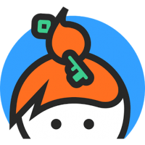

```{r setup, include=FALSE}
options(htmltools.dir.version = FALSE)
```

class: middle
name: cc-by

### Get the slides at [short URL]()

### Read the blog post at [URL]()

These slides and blog post are available under a **creative common
[CC-BY license](http://creativecommons.org/licenses/by/4.0/)**. You
are free to share (copy and redistribute the material in any medium or
format) and adapt (remix, transform, and build upon the material) for
any purpose, even commercially .


---
class: middle, inverse

I am **not** speaking from authority here. Authority generally comes
from seniority, and in most cases senior academics aren't those that
have much experience in open and reproducible research.


I don't plan listing technical solutions on how to implement open
and reproducible research.


The real challenges are the (academic) environment we are in, the
inertia of academia and the vested interests of many senior actors.


---
class: middle

## Open / reproducible != good

A piece of open research doesn't automatically make it good, where
good is defined as of high academic quality.


A piece of reproducible research doesn't automatically make it good,
where good is defined as of high academic quality.

---
class: middle

## Reproducible != open

<blockquote class="twitter-tweet" data-cards="hidden" data-lang="en"><p lang="en" dir="ltr">Many people seem to think that <a href="https://twitter.com/hashtag/OpenScience?src=hash&amp;ref_src=twsrc%5Etfw">#OpenScience</a> &amp; the reproducibility crisis in psychology are somehow causally related. They are not. Open science is decades old &amp; did not focus on reproducibility as a single issue — more here: <a href="https://t.co/KpJHIEqPj3">https://t.co/KpJHIEqPj3</a> &amp; here: <a href="https://t.co/KdMeK6PCUT">https://t.co/KdMeK6PCUT</a> <a href="https://t.co/qF5yPTqNqu">pic.twitter.com/qF5yPTqNqu</a></p>&mdash; Olivia Guest | Ολίβια Γκεστ (@o_guest) <a href="https://twitter.com/o_guest/status/1068791012481470464?ref_src=twsrc%5Etfw">December 1, 2018</a></blockquote>
<script async src="https://platform.twitter.com/widgets.js" charset="utf-8"></script>

---
class: middle

The **[Mertonian
norms](https://en.wikipedia.org/wiki/Mertonian_norms)** (1942)

- **Communism**: all scientists should have common ownership of scientific
  goods (intellectual property), to promote collective collaboration;
  secrecy is the opposite of this norm.

- **Universalism**: scientific validity is independent of the
  sociopolitical status/personal attributes of its participants.

- **Disinterestedness**: scientific institutions act for the benefit of a
  common scientific enterprise, rather than for the personal gain of
  individuals within them
  
- **Organised scepticism**: scientific claims should be exposed to
  critical scrutiny before being accepted: both in methodology and
  institutional codes of conduct.


---
class: middle, inverse, center

## So what is open research?

---
class: middle

> Open science/research is the process of transparent dissemination
> and access to knowledge, that can be applied to various scientific
> practices.


---
class: middle, center


---
class: middle, inverse, center

## Open research isn't stamp collection!

---
class: middle, center

<blockquote class="twitter-tweet"><p lang="en" dir="ltr">21 Tips on
how to sound <a
href="https://twitter.com/hashtag/openscience?src=hash&amp;ref_src=twsrc%5Etfw">#openscience</a>:
in the last three weeks before x-mas, I will tweet on tip each day on
how to sound like an open scientist, without actually doing open
science. Enjoy! <a
href="https://t.co/K7TXb9UmHM">pic.twitter.com/K7TXb9UmHM</a></p>&mdash;
Egon Willighⓐgen (@egonwillighagen) <a
href="https://twitter.com/egonwillighagen/status/1334411812973015040?ref_src=twsrc%5Etfw">December
3, 2020</a></blockquote> <script async
src="https://platform.twitter.com/widgets.js"
charset="utf-8"></script>


---
class: middle, inverse

> Open science/research can mean different things to different people,
> in particular when declined it along its many technical and
> philosophical attributes.

---
class: middle, inverse, middle

## Don't exclude based on a definition of openness

---
class: middle, inverse


So my very first take-home messages are:


> Open isn't binary, it's a gradient, it's multidisciplinary, it's
> multidimensional.

How to be an open scientist:

> Let's be open and understanding of different situations and
> constraints, including our own.


---
class: middle, inverse, center

## Open research as a business: 
## ~~Open Access~~ 
## **Open Acce$$**

---
class: middle

- **Green open access**: post your **pre-print** (on
  [arXiv](https://arxiv.org/), [bioRXiv](https://www.biorxiv.org/),
  ...), get a DOI and credit. :-)

- **Gold open access**: pay a lot of moeny (APC article processing
  charge), typically 3000 -
  [9000](https://www.nature.com/articles/d41586-020-03324-y) Euros to
  publish your article in a journal under an open access
  licence. **For-profit** publishing (typically **huge profits**). :-(

- **Platinum (diamond) open access**: 100% free to pubish and free to
  read, usually financed by university, funders, research
  organisations centrally. **Non-profit publishing**. :-)

- **Read and publish 'transformative' agreements**: combining
  subscriptions (to read) and APCs into big deals, this (1)
  obfuscating real costs, (2) lock-in into a contract with specific
  publishers, and (3) discriminate against institutions/countries that
  can't afford them (see this
  [document](https://docs.google.com/document/d/1TUuoHV8yA0TSLUCo0PhrzfR5lwWruZQibKimOoVVJ6E/edit?usp=sharing)
  by Corina Logan and Dieter Lukas for more details). :-(


---
class: middle, center, inverse

## Open research and open research


---
class: middle, inverse

There is 

> Open Science as in widely disseminated and openly accessible

and

> Open Science as in inclusive and welcoming

---
class: middle, center


<blockquote class="twitter-tweet" data-conversation="none"
data-lang="en"><p lang="en" dir="ltr">It was a damned hard community
to break into. Any step I took to be more open, I felt attacked for
not doing enough/doing it right.</p>&mdash; Christie Bahlai (@cbahlai)
<a href="https://twitter.com/cbahlai/status/871413258107981824">June
4, 2017</a></blockquote> <script async
src="//platform.twitter.com/widgets.js" charset="utf-8"></script>


---
class: middle

Not everybody has the privilege to be open.

There are different levels in how open one wants, or how open one could afford to be.


Every voice and support is welcome.

---
class: middle, center

<blockquote class="twitter-tweet" data-lang="en"><p lang="en"
dir="ltr">The primary value proposition of <a
href="https://twitter.com/hashtag/openscience?src=hash">#openscience</a>
is that diverse contributions allow better critique, refinement, and
application 3/n</p>&mdash; CⓐmeronNeylon (@CameronNeylon) <a
href="https://twitter.com/CameronNeylon/status/895546764861853696">August
10, 2017</a></blockquote> <script async
src="//platform.twitter.com/widgets.js" charset="utf-8"></script>

---
class: middle, center, inverse

## Ethical publishing

---
class: middle


.left-col-70[

[Corina Logan](http://corinalogan.com/)
([@LoganCorina](https://twitter.com/LoganCorina) on twitter) started
to talk already many years ago about ethical publishing (for research
dissemination at large). I wasn't immediately sold on the phrasing,
but I now came to the realisation that it's absolutely spot on.

> We should think about the ethical implications of how we perform and
> disseminate our research.

(Thank you Corina).
]

.rigth-col-30[

]

---
class: middle, center, inverse

## Why becoming an open research practitioners


---
class: middle
name: laurent-gatto

.left-col-50[

### Laurent Gatto
<i class="fas fa-flask"></i>&nbsp;[Computational Biology Group](https://lgatto.github.io/cbio-lab/)<br />
<i class="fas fa-map-marker-alt"></i>&nbsp;de Duve Institute, UCLouvain<br />
<i class="fas fa-envelope"></i>&nbsp;laurent.gatto@uclouvain.be<br />
<i class="fas fa-home"></i>&nbsp;https://lgatto.github.io<br />
<i class="fab fa-twitter"></i>&nbsp;[@lgatto](https://twitter.com/lgatt0/)<br />
<i class="fab fa-github"></i>&nbsp;[lgatto](https://github.com/lgatto/)<br />
&nbsp;[0000-0002-1520-2268](https://orcid.org/0000-0002-1520-2268)<br />
&nbsp;[lgatto](https://keybase.io/lgatto)<br />
&nbsp;[Google scholar](https://scholar.google.co.uk/citations?user=k5DrB74AAAAJ&hl=en)<br />
&nbsp;[Impact story](https://profiles.impactstory.org/u/0000-0002-1520-2268)<br />
<i class="fas fa-pencil-alt"></i>&nbsp;[dissem.in](https://dissem.in/r/6231/laurent-gatto)<br />
<!-- <i class="fab fa-linkedin"></i>&nbsp;https://www.linkedin.com/in/lgatto/<br /> -->
]

.rigth-col-50[

**Acknowledgements**: ...

## Thank you for your attention

### Find the slides [online](https://raw.githack.com/lgatto/slide-templates/master/my_template.html).
]
